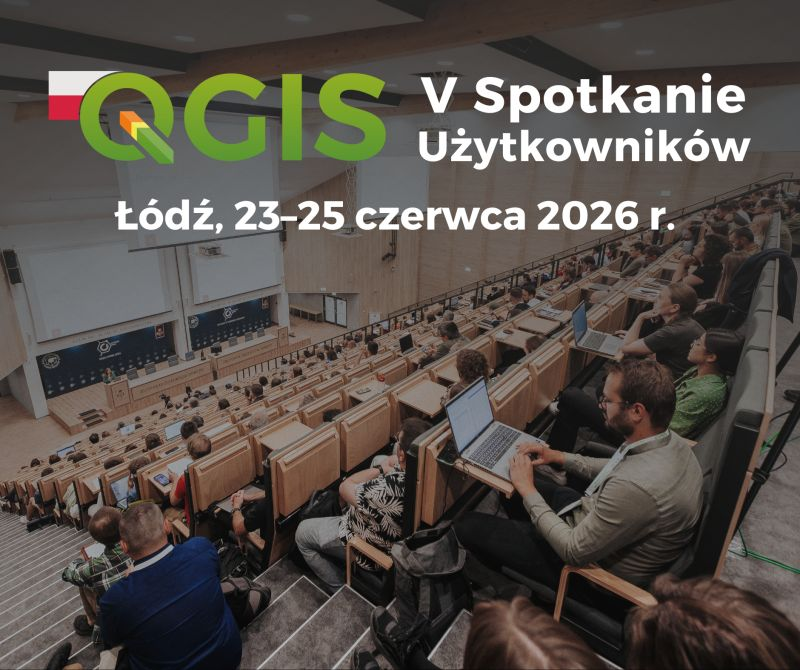
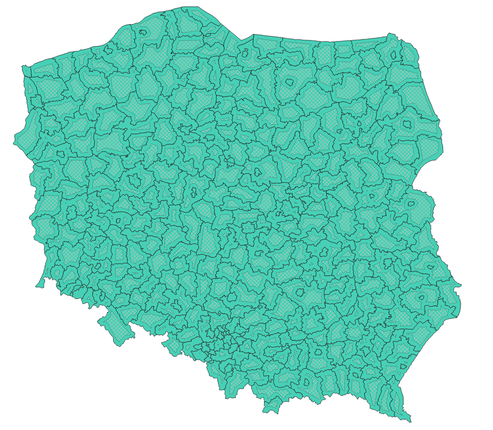
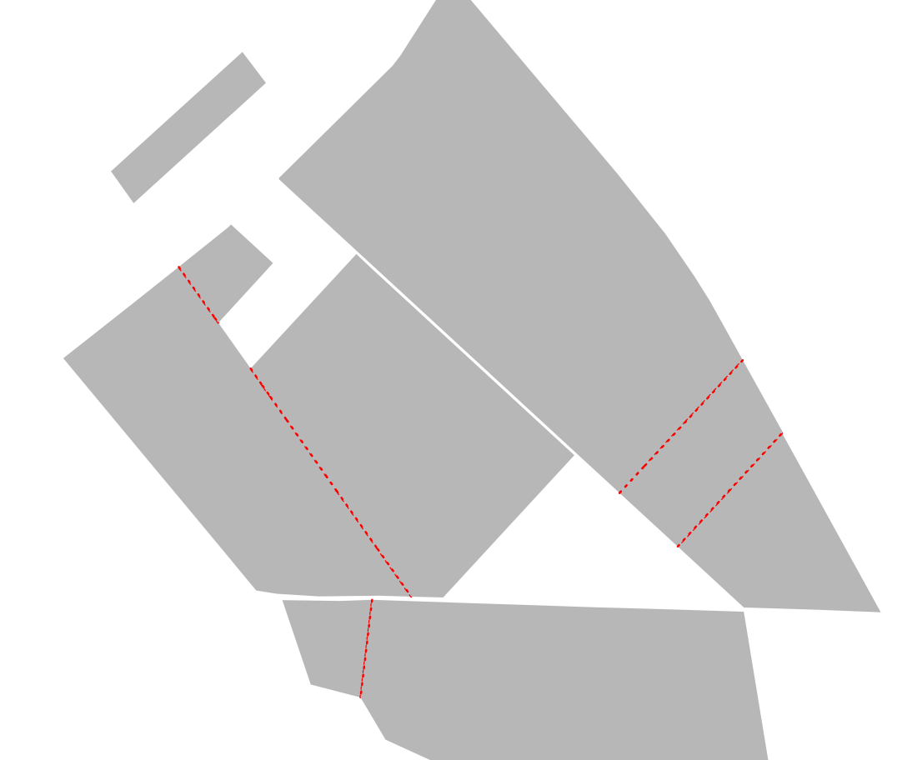
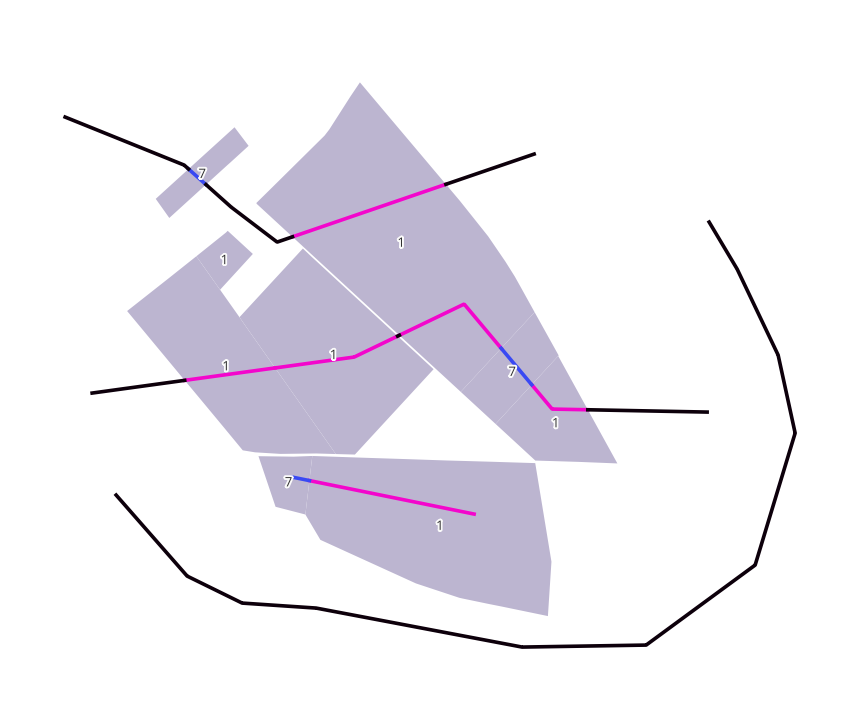
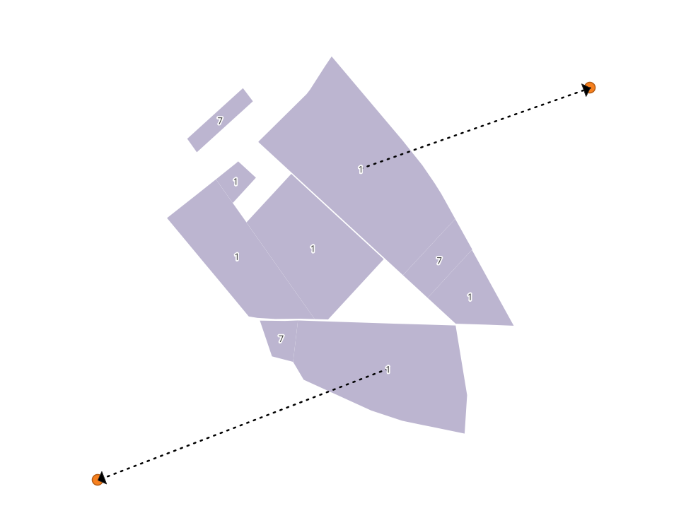
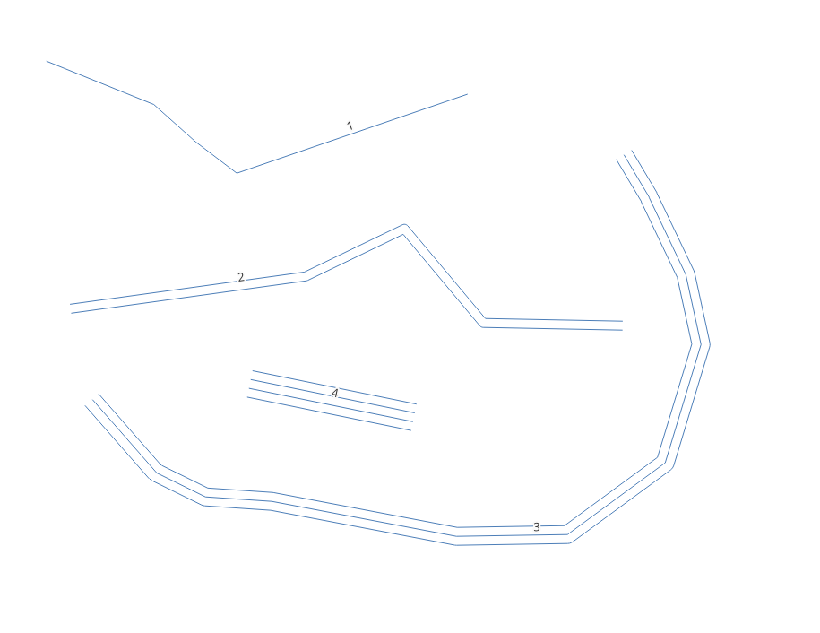
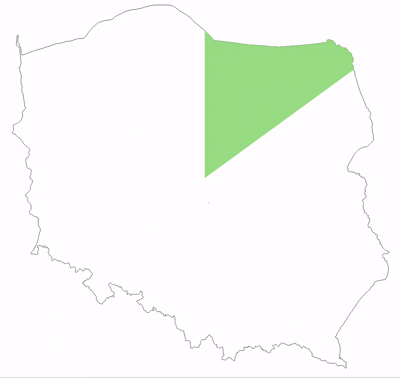

# Warsztaty Symbolizacja na sterydach: Magia w Generatorze Geometrii
Materiały na warsztaty "Symbolizacja na sterydach: Magia w Generatorze Geometrii" w ramach V Spotkania Użytkowników QGIS 2026 w łodzi.

Warsztaty będą obejmowały praktyczne przykłądy z wykorzystania generatora geometrii w QGIS

### Co potrzebujesz na warsztaty?
Jedyne czego potrzebujesz to komputer z QGISem (sugerowany QGIS 4). Wszystkie dane i przykłady znajdziesz w tym repozytorium.

### Ćwiczenia
#### 1.Przykład z buforami
[01_bufory](01_bufory)

#### 2.Wizualizacja poligonów za pomocą okręgów
[02_wizualizacja punktowa](02_wizualizacja%20punktowa)

#### 3.Wizualizacja granic stykających się poligonów
[03_granice](03_granice)

#### 4.Wizualizacja relacji przestrzennych między poligonami i liniami
[04_relacje](04_relacje)

#### 5.Wizualizacja relacji przestrzennych między poligonami i punktami
[05_relacje2](05_relacje2)

#### 6.Wizualizacja wielokrotneg geometrii dla linii na podstawie atrybutów
[06_linie](06_linie)

#### 7.Wizualizacja poligonu jako zegara sekundowego
[07_zegar](07_zegar)
